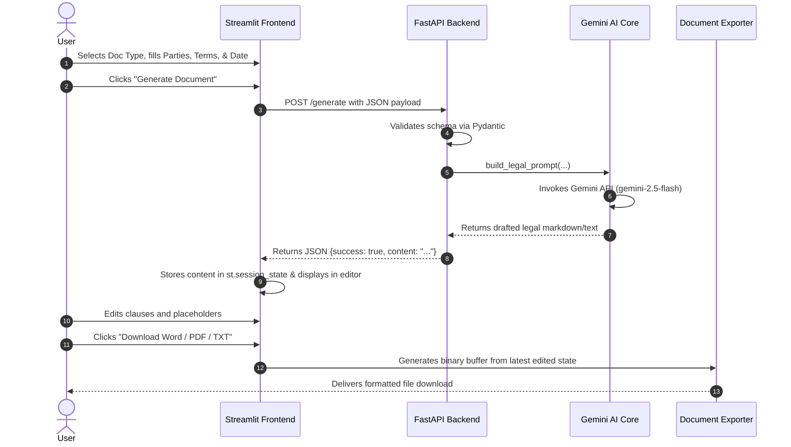

# Phase 3 — Project Design & Architecture

## 1. System Architecture

```text
+-------------------------------------------------------------+
|                      USER BROWSER                           |
|       Streamlit Frontend (app.py, document_editor.py)       |
+------------------------------+------------------------------+
                               |
                               | HTTP POST /generate
                               v
+-------------------------------------------------------------+
|                      FASTAPI BACKEND                        |
|       - Request Validation (Pydantic / schemas.py)          |
|       - Document Service (document_service.py)              |
+------------------------------+------------------------------+
                               |
                               v
+-------------------------------------------------------------+
|                       AI CORE MODULE                        |
|       - Prompt Builder (prompt_builder.py)                  |
|       - Google Gemini Client (gemini_generator.py)          |
+------------------------------+------------------------------+
                               |
                               | Google Generative Language API
                               v
+-------------------------------------------------------------+
|                     GOOGLE GEMINI AI                        |
|               (gemini-2.5-flash / 1.5-flash)                |
+------------------------------+------------------------------+
                               |
                               v
+-------------------------------------------------------------+
|               EXPORT & FORMATTING ENGINES                   |
|       - TXT Generator (Plain Text Bytes)                    |
|       - DOCX Generator (python-docx, Typography, Footers)   |
|       - PDF Generator (fpdf2, Header, Pagination)           |
+-------------------------------------------------------------+
```

## 2. Component Design & Responsibilities

| Layer / Component | Primary Responsibility | Key Files |
| :--- | :--- | :--- |
| **Frontend** | Collects user input, manages session state, displays editable view, provides download buttons. | `frontend/app.py`, `frontend/components/document_editor.py` |
| **Backend API** | Exposes REST endpoints, validates inputs, controls cross-origin requests. | `backend/main.py`, `backend/routes.py`, `backend/schemas.py` |
| **AI Orchestration**| Constructs legal prompts according to document type guidelines and executes Gemini calls. | `backend/ai_core/prompt_builder.py`, `backend/ai_core/gemini_generator.py` |
| **Document Formatter**| Transforms raw/edited text into formatted binary file streams (`.txt`, `.docx`, `.pdf`). | `document_generators/txt_generator.py`, `document_generators/docx_generator.py`, `document_generators/pdf_generator.py` |

## 3. Data Flow Diagram


